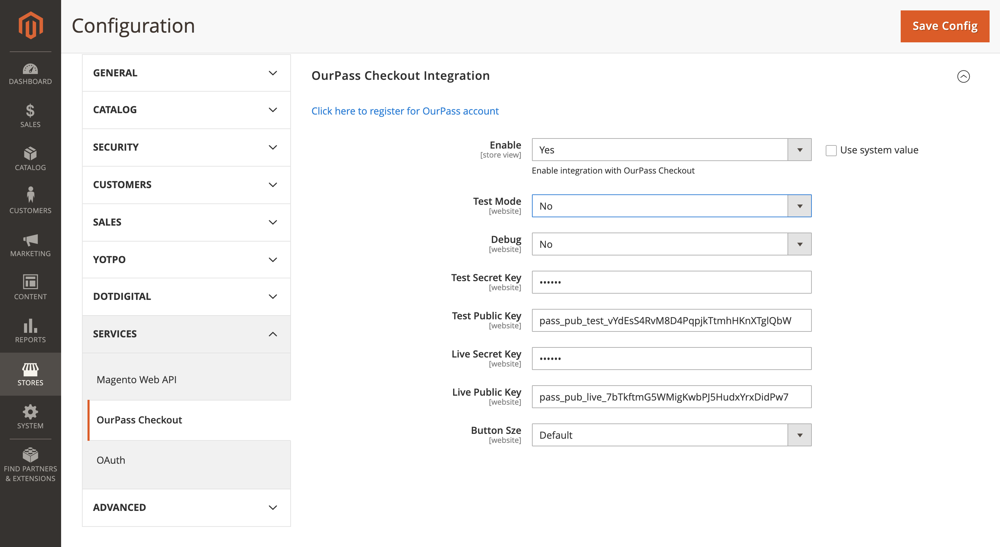

# Installation
using composer, in your magento webroot, issue the following commands:

```
composer require ourpass/module-checkout
php bin/magento module:enable OurPass_Checkout
php bin/magento setup:upgrade
php bin/magento setup:di:compile
php bin/magento setup:static-content:deploy
```

if for some reason composer is not available, obtain the files from the repo, and place them in app/code/OurPass/Checkout and then
```
php bin/magento module:enable OurPass_Checkout
php bin/magento setup:upgrade
php bin/magento setup:di:compile
php bin/magento setup:static-content:deploy
```

# Configuration
1. Navigate to Stores → Configuration
2. Navigate to Services → OurPass Checkout



**Enable** - this option allows you to enable the OurPass Checkout integration with your Magento store(s). Before enabling the extension, you must fill in the test and live keys.
**Test Mode** - select Yes, to enable test environment.
**Debug** - use this selector to have some log on your system. This setting is not recommended in production systems with low resources.
**Test secret key** - is given to you by OurPass when setting up account.
**Test public key** - is given to you by OurPass when setting up account.
**Live secret key** - is given to you by OurPass when setting up account.
**Live public key** - is given to you by OurPass when setting up account.
**Button Size** - select button size preferred.

1. Test secret key
2. Test public key
3. Live secret key
4. Live public key
5. Save Config
6. Enable = Yes
7. Save Config

# Payment Method
The ourpass extension will create a new payment method in the magento backend. Orders placed with the ourpass buttons will show this as their payment method. Customer/Admin placed orders cannot select this payment method.
